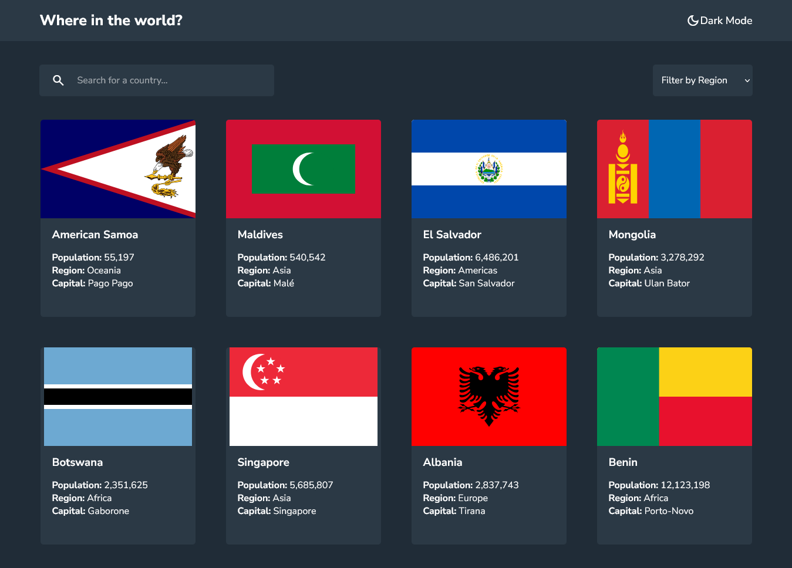
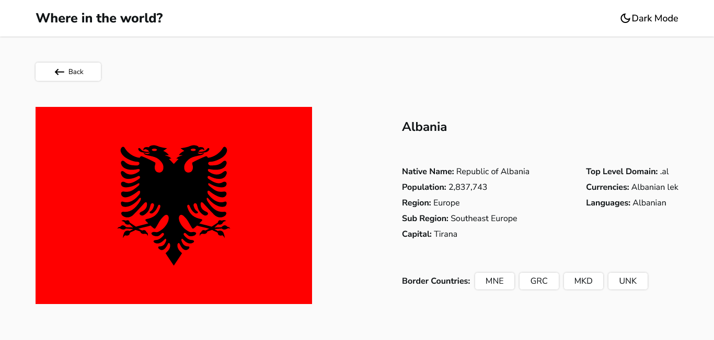

# Rest Countries API with color theme switcher

This is a solution to the [REST Countries API with color theme switcher challenge on Frontend Mentor](https://www.frontendmentor.io/challenges/rest-countries-api-with-color-theme-switcher-5cacc469fec04111f7b848ca).

## Table of contents

- [Overview](#overview)
  - [The challenge](#the-challenge)
  - [Screenshots](#screenshots)
  - [Links](#links)
- [My process](#my-process)
  - [Built with](#built-with)
- [Author](#author)

## Overview

### The challenge

Users should be able to:

- See all countries from the API on the homepage
- Search for a country using an `input` field
- Filter countries by region
- Click on a country to see more detailed information on a separate page
- Toggle the color scheme between light and dark mode

### Screenshots

### Links

- Solution URL: https://github.com/HediElOuni/Rest-Countries-API
- Live Site URL: https://rest-countries-api-heo.netlify.app

## My process

### Built with

- HTML
- CSS
- JavaScript
- API

## Author

- LinkedIn: [@HediElOuni](https://www.linkedin.com/in/hedi-el-ouni-962abb25b/)
